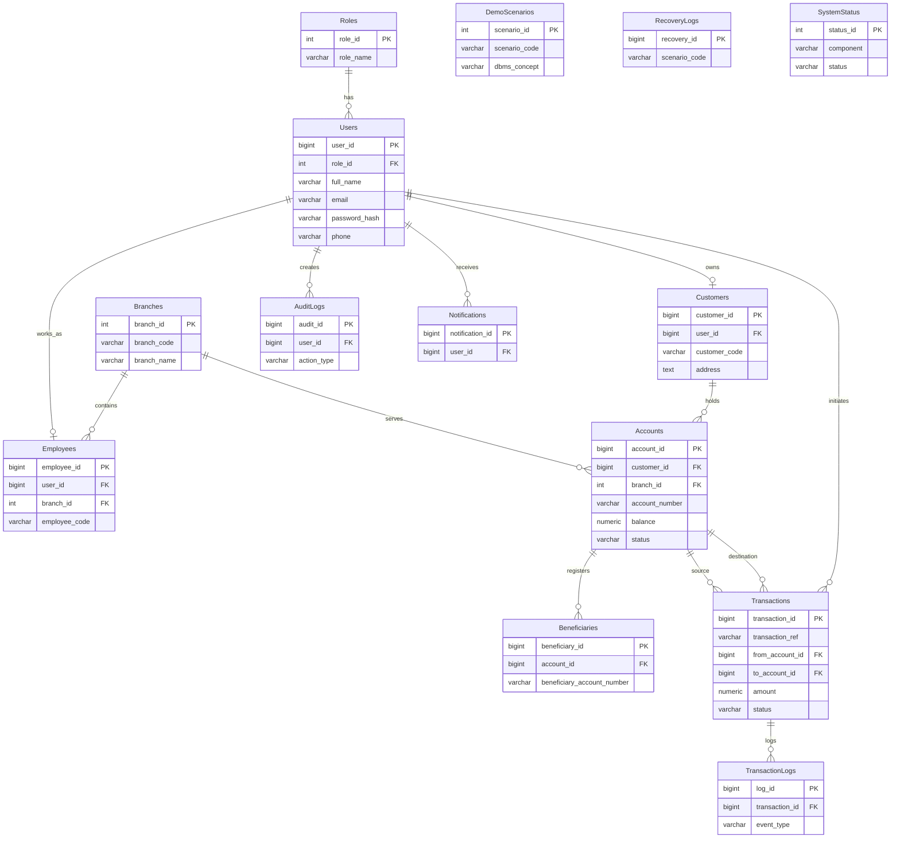

# ER Diagram (Mermaid)

```mermaid
erDiagram
  Roles ||--o{ Users : has
  Users ||--o| Customers : owns
  Users ||--o| Employees : works_as
  Branches ||--o{ Employees : contains
  Branches ||--o{ Accounts : serves
  Customers ||--o{ Accounts : holds
  Accounts ||--o{ Beneficiaries : registers
  Accounts ||--o{ Transactions : source
  Accounts ||--o{ Transactions : destination
  Users ||--o{ Transactions : initiates
  Transactions ||--o{ TransactionLogs : logs
  Users ||--o{ AuditLogs : creates
  Users ||--o{ Notifications : receives

  Roles {
    int role_id PK
    varchar role_name
  }
  Users {
    bigint user_id PK
    int role_id FK
    varchar full_name
    varchar email
    varchar password_hash
    varchar phone
  }
  Customers {
    bigint customer_id PK
    bigint user_id FK
    varchar customer_code
    text address
  }
  Employees {
    bigint employee_id PK
    bigint user_id FK
    int branch_id FK
    varchar employee_code
  }
  Branches {
    int branch_id PK
    varchar branch_code
    varchar branch_name
  }
  Accounts {
    bigint account_id PK
    bigint customer_id FK
    int branch_id FK
    varchar account_number
    numeric balance
    varchar status
  }
  Beneficiaries {
    bigint beneficiary_id PK
    bigint account_id FK
    varchar beneficiary_account_number
  }
  Transactions {
    bigint transaction_id PK
    varchar transaction_ref
    bigint from_account_id FK
    bigint to_account_id FK
    numeric amount
    varchar status
  }
  TransactionLogs {
    bigint log_id PK
    bigint transaction_id FK
    varchar event_type
  }
  AuditLogs {
    bigint audit_id PK
    bigint user_id FK
    varchar action_type
  }
  Notifications {
    bigint notification_id PK
    bigint user_id FK
  }
  DemoScenarios {
    int scenario_id PK
    varchar scenario_code
    varchar dbms_concept
  }
  RecoveryLogs {
    bigint recovery_id PK
    varchar scenario_code
  }
  SystemStatus {
    int status_id PK
    varchar component
    varchar status
  }
```
